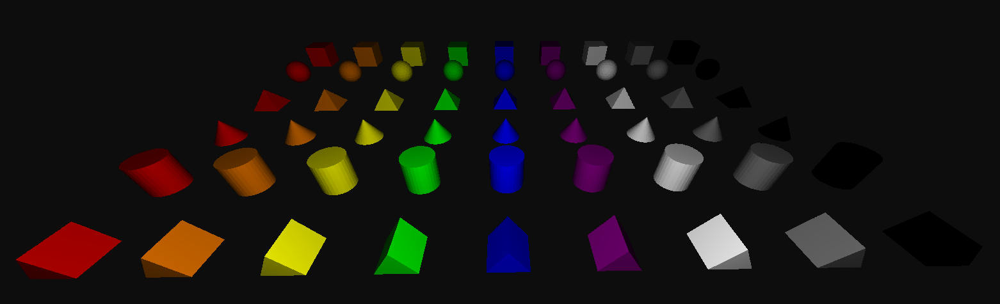

<h1 align="center">
  Primitive Shape Builder
   
  
</h1>

> ## What is Primitive Shape Builder?
> 
> Primitive Shape Builder is an OpenTK 3D scene editor that allows users to spawn shapes, color them, rotate and scale them *(WIP)*, and save the scene to a file *(WIP)*. This project was designed as part of the AP Computer Science Principles (APCSP) course.
> 
>  *Everything is subject to change as it is in a pre-alpha state.*

> ## Controls
>
> ### Movement:
> - **WASD**: move around
> - **Space**: fly up
> - **Left Shift**: fly down
> - **Mouse Move**: look around
>
> ### Building:
> - **Right Click**: place shape
> - **Scroll**: change shape
> - **Scroll + Ctrl**: change color
>
> ### User Interface:
> - **Escape**: quit program
> - **Tab**: toggle cursor state
> - **F1**: toggle UI elements
> - **F11**: toggle fullscreen

> ## Objects and Colors
>
> ### Objects:
> - **Cube, Sphere, Square Pyramid, Cone, Cylinder, Triangular Prism**
>
> ### Colors:
> - **Red, Orange, Yellow, Green, Blue, Purple, White, Gray, Black**
>
>   
> 
>  *More objects and colors will be added in later updates.*
